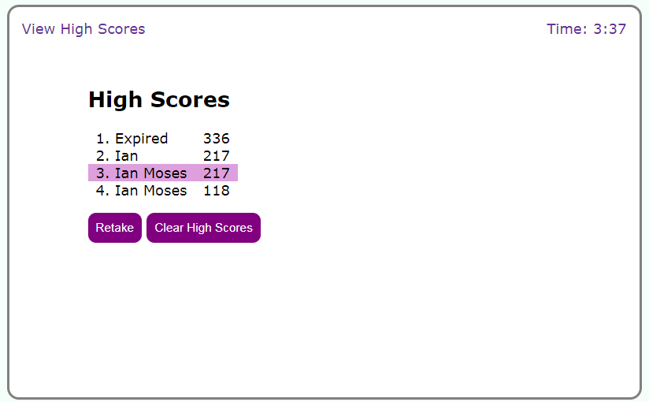

# Code Quiz

## Description

This is a fun code quiz. Answer some javascript code questions and see how well you can do! It saves your scores so you can compare your scores as your knowledge grows! Contains 6 questions.

## Website

You can access the deployed website here:
 
https://moses-ian.github.io/code-quiz/

### Screenshots

## Credits

* I followed the mock up from UofA Coding Bootcamp Challenge 4.
* I used questions from UofA Coding Bootcamp Module 4.

## License

Please do not copy any of my code.

## Contributions

Made by Ian Moses